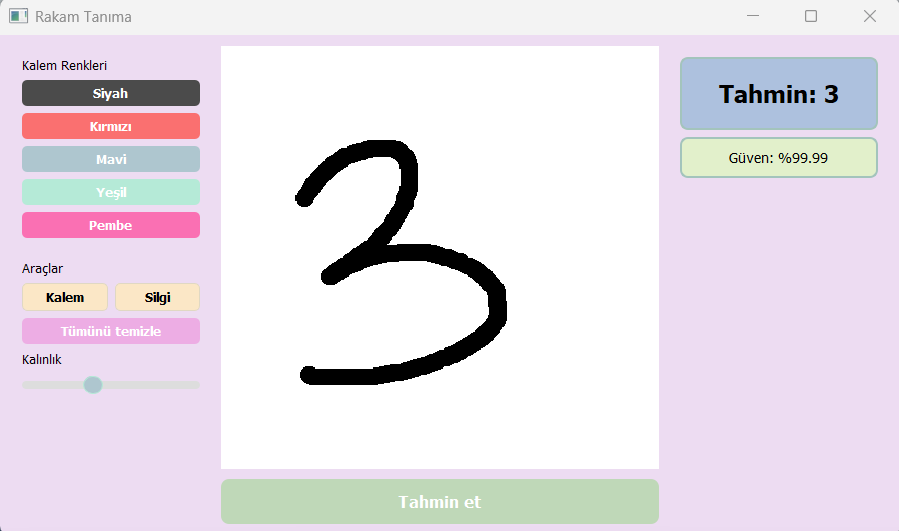
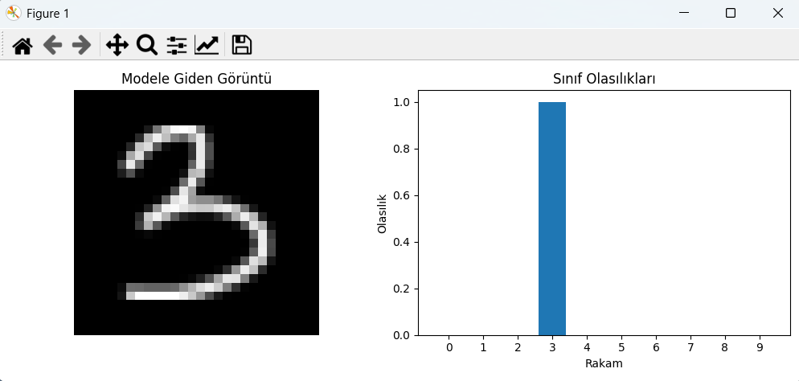

# El Yazısı Rakam Tanıma

- Bu proje, MNIST veri seti ile eğitilmiş bir Convolutional Neural Network (CNN) kullanarak  
kullanıcının çizdiği el yazısı rakamları tahmin eden bir masaüstü uygulamasıdır.

- Proje hem model eğitimi hem de grafik arayüz (GUI) tarafını içermektedir.

---

##  Uygulama Ana Ekranı

  

- Kullanıcı bu ekranda sol panelden kalem rengi ve kalınlığı ayarlar,orta panele fare ile rakam çizer, 
ve Tahmin Et butonu ile modeli çalıştırır.

- Sağ panelde tahmin edilen rakamı ve modelin güven oranını görebilir

---

## Debug & Model Girdisi

  

Bu pencerede:
- Modele giden **28x28 ön işlenmiş görüntü**
- 0–9 arası sınıf olasılıkları (bar chart)

gösterilir.  
Preprocessing hatalarını görmek için özellikle faydalıdır.

---

##  Özellikler

- MNIST veri seti ile CNN eğitimi
- En iyi modelin `.keras` formatında kaydedilmesi
- PyQt tabanlı çizim arayüzü
- Kalem / silgi / renk / kalınlık ayarları
- Modele giden 28x28 görüntünün debug gösterimi
- 0–9 arası sınıf olasılıklarını bar chart ile gösterme

---

##  Kullanılan Teknolojiler

- Python 
- TensorFlow / Keras
- NumPy
- Pillow (PIL)
- Matplotlib
- Tkinter
- PyQt5

---

##  Gereklilikler

- python 3.10.11 

 - `pip install tensorflow numpy pillow matplotlib pyqt5`

##  Release

- releases kısmından programı kullanıma hazır .exe halinde indirip deneyebilirsiniz
